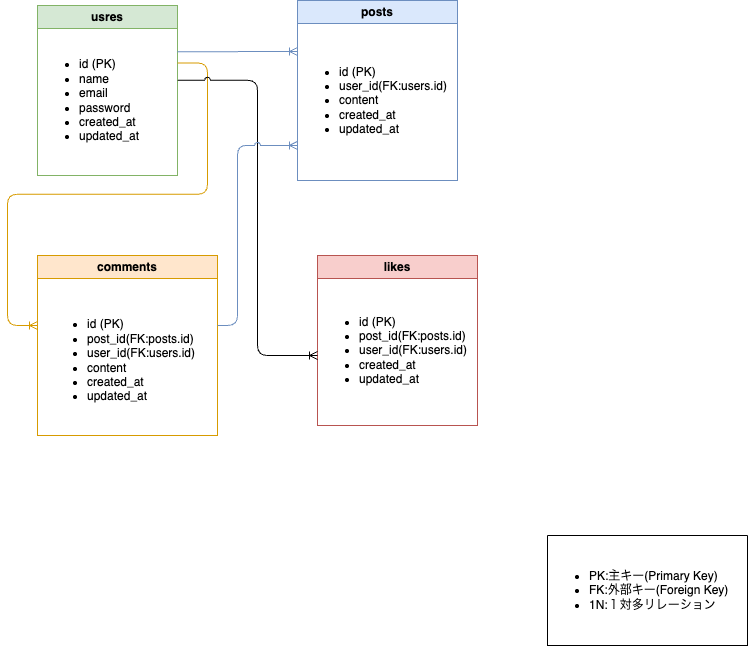

# twitter-sns-app

> ⚠️ **このプロジェクトは Nuxt2 を使用しています。**
> Nuxt3 ではなく Nuxt2 のインストールを行ってください。

## Nuxt2 のインストール方法

```bash
# Nuxt2 を明示的にインストールする場合
$ yarn add nuxt@2
# または npm を使う場合
$ npm install nuxt@2
```

## セットアップ手順

```bash
# 依存パッケージのインストール
$ yarn install

# 開発サーバーを起動（ホットリロード対応、localhost:3000）
$ yarn dev

# 本番用ビルド & サーバー起動
$ yarn build
$ yarn start

# 静的サイトの生成
$ yarn generate
```

詳細な使い方や設定については [Nuxt.js 公式ドキュメント](https://nuxtjs.org) をご参照ください。

## 主なディレクトリ構成

- assets : CSS や画像、フォント等
- components : Vue コンポーネント
- layouts : アプリ全体のレイアウト
- pages : 画面・ルーティング
- plugins : Vue プラグインや初期化 JS
- static : 静的ファイル（画像・robots.txt 等）

## 環境構築

- 1.リポジトリをクローン
- 2.依存パッケージをインストール
```bash
$ yarn install
```

- 3.開発サーバー起動
```bash
$ npm run dev
```

## 使用技術

-  Nuxt.js v2
-  Vue.js
-  Firebase Authentication
-  Laravel (API サーバー)
-  VeeValidate (バリデーション)

## 実装機能

- ユーザー登録・ログイン (Firebase認証/メールアドレス認証)
- 投稿作成・一覧表示・削除
- コメント投稿・一覧表示
- 投稿への「いいね」機能
- バリデーション (VeeValidateによる入力チェック)
- ログイン状態の保持・ログアウト
- レシポン渋る対応UI


## テーブル構成

### ER図




## メール認証機能

- Firebase Authentication を利用したメールアドレス・パスワードによるユーザー認証
- 新規登録時にメールアドレスの形式チェック・重複チェック
- ログイン時にメールアドレス・パスワードの組み合わせを検証

## テストユーザー

- メールアドレス: testuser@example.com
- パスワード: password123

## URL

- 開発環境: http://localhost:3000/
- APIサーバー: http://127.0.0.1:8000/api/posts. (投稿一覧)

